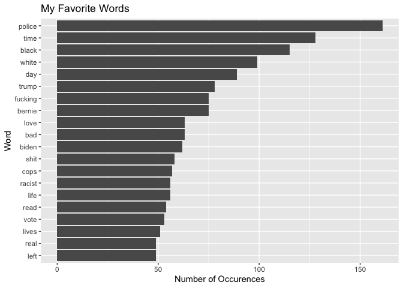
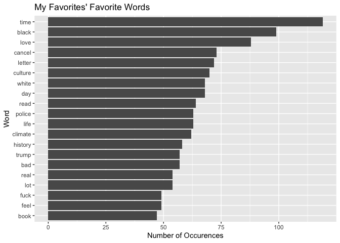
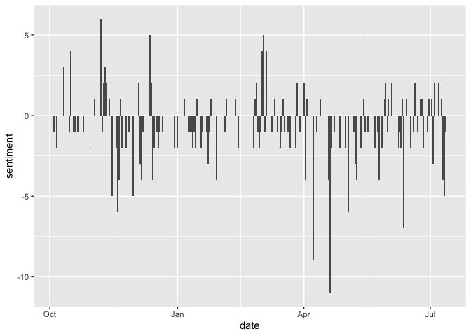

Unnamed Twitter Project
================
James Hare
7/11/2020

``` r
knitr::opts_chunk$set(echo = TRUE)
library(tidyverse)
```

    ## ── Attaching packages ─────────────────────────────────────────────────────────────────────────────── tidyverse 1.3.0 ──

    ## ✓ ggplot2 3.3.2     ✓ purrr   0.3.4
    ## ✓ tibble  3.0.2     ✓ dplyr   1.0.0
    ## ✓ tidyr   1.1.0     ✓ stringr 1.4.0
    ## ✓ readr   1.3.1     ✓ forcats 0.5.0

    ## ── Conflicts ────────────────────────────────────────────────────────────────────────────────── tidyverse_conflicts() ──
    ## x dplyr::filter() masks stats::filter()
    ## x dplyr::lag()    masks stats::lag()

``` r
library(rtweet)
```

    ## 
    ## Attaching package: 'rtweet'

    ## The following object is masked from 'package:purrr':
    ## 
    ##     flatten

``` r
library(tidytext)
library(lubridate)
```

    ## 
    ## Attaching package: 'lubridate'

    ## The following objects are masked from 'package:base':
    ## 
    ##     date, intersect, setdiff, union

I wonder who my favorite tweeters are.

``` r
#This is the code to get favorites, but it shouldn't run automatically due to
#rate limits
#
#james <- get_favorites("ProsccoSocialst", n = 3000)
#write_as_csv(james, "data/james.csv")

james <- read_csv("data/james.csv")
```

    ## Parsed with column specification:
    ## cols(
    ##   .default = col_character(),
    ##   created_at = col_datetime(format = ""),
    ##   display_text_width = col_double(),
    ##   is_quote = col_logical(),
    ##   is_retweet = col_logical(),
    ##   favorite_count = col_double(),
    ##   retweet_count = col_double(),
    ##   quote_count = col_logical(),
    ##   reply_count = col_logical(),
    ##   symbols = col_logical(),
    ##   ext_media_type = col_logical(),
    ##   quoted_created_at = col_datetime(format = ""),
    ##   quoted_favorite_count = col_double(),
    ##   quoted_retweet_count = col_double(),
    ##   quoted_followers_count = col_double(),
    ##   quoted_friends_count = col_double(),
    ##   quoted_statuses_count = col_double(),
    ##   quoted_verified = col_logical(),
    ##   retweet_status_id = col_logical(),
    ##   retweet_text = col_logical(),
    ##   retweet_created_at = col_logical()
    ##   # ... with 21 more columns
    ## )

    ## See spec(...) for full column specifications.

``` r
my_fav_tweeters <- james %>%
        count(screen_name, sort = TRUE) %>%
        slice(1:10)

ggplot(my_fav_tweeters) +
        geom_col(mapping = aes(reorder(screen_name, n), n)) +
        coord_flip() +
        labs(title = "My Favorite Tweeters",
             x = "Screen Name",
             y = "Number of Favorites")
```

<!-- -->

I wonder who their favorites are.

``` r
#Code that shouldn't run automatically due to rate limits
#
#my_favs_favs <- get_favorites(my_fav_tweeters$screen_name, n = 300)
#write_as_csv(my_favs_favs, "data/my_favs_favs.csv")

my_favs_favs <- read_csv("data/my_favs_favs.csv")
```

    ## Parsed with column specification:
    ## cols(
    ##   .default = col_character(),
    ##   created_at = col_datetime(format = ""),
    ##   display_text_width = col_double(),
    ##   is_quote = col_logical(),
    ##   is_retweet = col_logical(),
    ##   favorite_count = col_double(),
    ##   retweet_count = col_double(),
    ##   quote_count = col_logical(),
    ##   reply_count = col_logical(),
    ##   symbols = col_logical(),
    ##   ext_media_type = col_logical(),
    ##   quoted_created_at = col_datetime(format = ""),
    ##   quoted_favorite_count = col_double(),
    ##   quoted_retweet_count = col_double(),
    ##   quoted_followers_count = col_double(),
    ##   quoted_friends_count = col_double(),
    ##   quoted_statuses_count = col_double(),
    ##   quoted_verified = col_logical(),
    ##   retweet_status_id = col_logical(),
    ##   retweet_text = col_logical(),
    ##   retweet_created_at = col_logical()
    ##   # ... with 21 more columns
    ## )

    ## See spec(...) for full column specifications.

    ## Warning: 1 parsing failure.
    ##  row     col           expected actual                    file
    ## 2182 symbols 1/0/T/F/TRUE/FALSE   TSLA 'data/my_favs_favs.csv'

``` r
my_favs_fav_tweeters <- my_favs_favs %>%
        count(screen_name, sort = TRUE) %>%
        slice(1:10)

ggplot(my_favs_fav_tweeters) +
        geom_col(mapping = aes(reorder(screen_name, n), n)) +
        coord_flip() +
        labs(title = "My Favorite Tweeters' Favorite Tweeters",
             x = "Screen Name",
             y = "Number of Favorites")
```

<!-- -->

I’m going to go ahead and follow anyone on this list who I’m not already
following.

Let’s see which words show up most often in tweets that I have
favorited.

``` r
remove_reg <- "&amp;|&lt;|&gt;"
tidy_james_favs <- james %>%
        filter(!str_detect(text, "^RT")) %>%
        mutate(text = str_remove_all(text, remove_reg)) %>%
        unnest_tokens(word, text, token = "tweets") %>%
        filter(
                !word %in% stop_words$word,!word %in% str_remove_all(stop_words$word, "'"),
                str_detect(word, "[a-z]")
        )
```

    ## Using `to_lower = TRUE` with `token = 'tweets'` may not preserve URLs.

``` r
word_count <- tidy_james_favs %>%
        filter(!str_detect(word, "^@")) %>%
        count(word, sort = TRUE) %>%
        #"people" shoes up way to often and doesn't tell us much
        filter(word != "people") %>%
        slice(1:20)

ggplot(word_count) +
        geom_col(mapping = aes(reorder(word, n), n)) +
        coord_flip() +
        labs(title = "My Favorite Words",
             x = "Word",
             y = "Number of Occurences")
```

<!-- -->

I guess I’m interested in Left politics and the uprising against racist
police violence.

Let’s see what words my favorites are favoriting.

``` r
tidy_favs_favs <- my_favs_favs %>%
        filter(!str_detect(text, "^RT")) %>%
        mutate(text = str_remove_all(text, remove_reg)) %>%
        unnest_tokens(word, text, token = "tweets") %>%
        filter(
                !word %in% stop_words$word,!word %in% str_remove_all(stop_words$word, "'"),
                str_detect(word, "[a-z]")
        )
```

    ## Using `to_lower = TRUE` with `token = 'tweets'` may not preserve URLs.

``` r
favs_word_count <- tidy_favs_favs %>%
        filter(!str_detect(word, "^@")) %>%
        count(word, sort = TRUE) %>%
        #"people" shoes up way to often and doesn't tell us much
        filter(word != "people") %>%
        slice(1:20)

ggplot(favs_word_count) +
        geom_col(mapping = aes(reorder(word, n), n)) +
        coord_flip() +
        labs(title = "My Favorites' Favorite Words",
             x = "Word",
             y = "Number of Occurences")
```

<!-- -->

A lot of overalap, but they seem more interested in that whole cancel
culture letter than I am.

Now let’s take a look at the words that I use in my own tweets.

``` r
#james_tweets <- get_timeline("ProsccoSocialst", n = 3000)
#write_as_csv(james_tweets, "data/james_tweets.csv")
james_tweets <- read_csv("data/james_tweets.csv")
```

    ## Parsed with column specification:
    ## cols(
    ##   .default = col_character(),
    ##   created_at = col_datetime(format = ""),
    ##   display_text_width = col_double(),
    ##   is_quote = col_logical(),
    ##   is_retweet = col_logical(),
    ##   favorite_count = col_double(),
    ##   retweet_count = col_double(),
    ##   quote_count = col_logical(),
    ##   reply_count = col_logical(),
    ##   symbols = col_logical(),
    ##   ext_media_type = col_logical(),
    ##   quoted_created_at = col_datetime(format = ""),
    ##   quoted_favorite_count = col_double(),
    ##   quoted_retweet_count = col_double(),
    ##   quoted_followers_count = col_double(),
    ##   quoted_friends_count = col_double(),
    ##   quoted_statuses_count = col_double(),
    ##   quoted_verified = col_logical(),
    ##   retweet_created_at = col_datetime(format = ""),
    ##   retweet_favorite_count = col_double(),
    ##   retweet_retweet_count = col_double()
    ##   # ... with 22 more columns
    ## )

    ## See spec(...) for full column specifications.

``` r
tidy_james_tweets <- james_tweets %>%
        filter(!str_detect(text, "^RT")) %>%
        mutate(text = str_remove_all(text, remove_reg)) %>%
        unnest_tokens(word, text, token = "tweets") %>%
        filter(
                !word %in% stop_words$word,!word %in% str_remove_all(stop_words$word, "'"),
                str_detect(word, "[a-z]")
        )
```

    ## Using `to_lower = TRUE` with `token = 'tweets'` may not preserve URLs.

``` r
tweets_word_count <- tidy_james_tweets %>%
        filter(!str_detect(word, "^@")) %>%
        count(word, sort = TRUE) %>%
        #"people" shoes up way to often and doesn't tell us much
        filter(word != "people") %>%
        slice(1:20)

ggplot(tweets_word_count) +
        geom_col(mapping = aes(reorder(word, n), n)) +
        coord_flip() +
        labs(title = "My Most Commonly Used Words",
             x = "Word",
             y = "Number of Occurences")
```

<!-- -->
